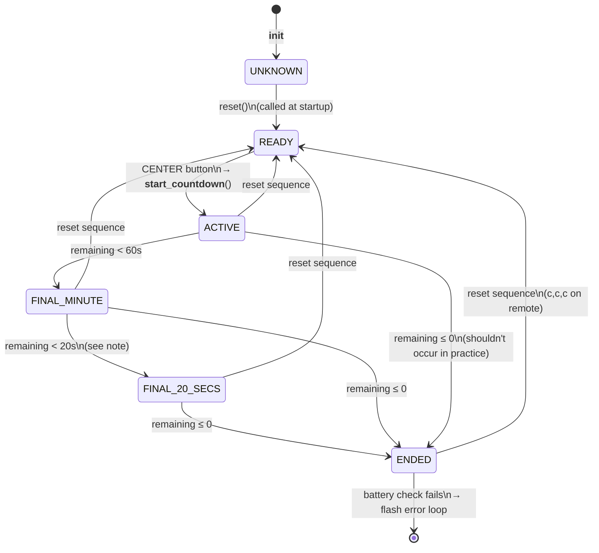
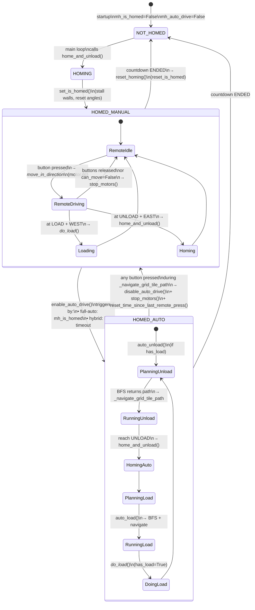

# ODV Movement System — Current State Analysis

A shared-context document for Claude and the dev, written before a redesign of
the movement system. Focused on `modules/vehicle_odv.py`. Sibling vehicles
(train, skid_steer, servo) are only touched where the shared base imposes
constraints on ODV.

---

## 1. Stated goals (from the dev)

1. **ODV = Omni-Directional Vehicle.** Moves in 8 compass directions (cardinals + diagonals).
2. **Two control modes.** Remote-controlled by a human, or automatic.
3. **Runs on a physical grid.** Motor rotation maps directly to position on
   the grid — no localisation, no sensors beyond motor encoders.
4. **Grid is made of physical LEGO tiles.** Described to the robot by an array
   of strings, one row per line, one character per tile.

The code aligns with all four. See `ODV_GRID_DEFAULT = ["L#<#U", …]`,
`_ALL_DIRECTIONS = (N, E, S, W, NE, SE, SW, NW)`, `Remote` in
`handle_remote_press`, `auto_load` / `auto_unload`.

---

## 2. Additional goals implied by the code

These aren't in the list above but the current implementation clearly targets
them. The redesign should explicitly decide which to preserve.

| # | Implied goal | Evidence |
|---|---|---|
| 5 | **Load/unload workflow.** The robot is a cart that picks up at `L` and drops at `U`. | `has_load` state, `_do_load_`, `auto_load`, `auto_unload`, `home_and_unload`. Modelled on Akiyuki's [Omni-Directional Vehicles GBC](https://rebrickable.com/mocs/MOC-224417) (README line 19). |
| 6 | **Absolute position from physical homing.** On startup the robot stalls against two perpendicular walls to establish (0,0); motor encoders are trusted thereafter. | `home_and_unload` — `run_until_stalled` NORTH then EAST, then `motor.reset_angle(...)`. |
| 7 | **One-way directed flow.** Tiles `<` and `>` let the grid designer force loops. | `WEST_ONLY_TRACK`, `EAST_ONLY_TRACK`, `ODV_GRID_EX3` = clockwise loop. |
| 8 | **Pre-drive collision safety.** The robot refuses commands that would drive it into a wall or into a one-way tile against its flow. | `can_move_in_direction_by_type`, `_can_traverse_coarse`. |
| 9 | **Runs on a memory-constrained PyBricks Technic Hub.** | `const()` everywhere, `mem_info()` debug calls, PLAN.md "O(N²) BFS memory crash" background, BFS rewritten with parent-pointer map. |
| 10 | **Three drive modes: manual / hybrid / full-auto.** | README table + `ODV_AUTO_DRIVE_TIMEOUT_SECS`, `REMOTE_DISABLED`, `mh_auto_drive`, `mh_is_homed` state in `MotorHelper`. |
| 11 | **Shared runtime with 3 other vehicle types.** Compiled per-vehicle to keep only one vehicle's code on the hub. | `tools/compile_pybricks_files.py`, `# IMPORTS_START/END`, `# MODULE_START/END`, `# DRIVE_SETUP_START/END` markers. |
| 12 | **Time-limited operation.** Countdown timer stops all vehicles after N minutes. | `CountdownTimer` in `lego_vehicle_timer_base.py`. Interactive-display use case. |
| 13 | **Graceful hand-off between auto and manual.** Any remote press interrupts an auto run. | `_navigate_grid_tile_path` checks `remote.buttons.pressed()` on every tile. |

---

## 3. Movement system as it stands today

### 3.1 Coordinate spaces

Three distinct spaces, all used simultaneously:

| Space | Unit | Where it lives | Derivation |
|---|---|---|---|
| **Coarse grid** | 1 tile | `(x, y)` ints | Grid string index |
| **Fine grid**   | 1/10 of a tile | `(x, y)` ints | `motor.angle() // _GEAR_RATIO_TO_GRID` |
| **Motor angle** | degrees | int | Direct from `motor.angle()` |

Constants that bind them:
- `_GEAR_RATIO_TO_GRID = 80` — motor degrees per fine unit
- `_FINE_GRID_SIZE = 10` — fine units per coarse tile (so 800° per tile)
- `_ODV_SIZE = 8` — cart footprint in fine units (≈ 0.8 tile)

Conversions:
- `_tile_to_angle(tile)` — coarse → motor angle
- `_get_fine_grid_position_()` — motor angle → fine
- `_get_grid_tile_from_fine_xy_(fine_pos, use_fuzzy)` — fine → coarse (with optional half-cart offset)
- `_navigate_to_grid_tile(tile)` — coarse → motor angle → `run_target`

### 3.2 Two parallel movement-validation paths

The rules (walls, one-way, UNLOAD-blocks-NORTH) are expressed twice:

| Path | Function | Input | Used by |
|---|---|---|---|
| **Realtime / fine** | `can_move_in_direction_by_type(dir, tl, tr, br, bl)` at `vehicle_odv.py:120` | 4 corner tile types of an `ODVBox` centred on the cart | `_can_move_in_direction_` → `handle_remote_press` |
| **Planning / coarse** | `_can_traverse_coarse(from_type, to_type, dir)` at `vehicle_odv.py:145` | Tile pair + direction | `_bfs_path_to_grid_tile` |

PLAN.md explicitly chose this split; both implementations currently stay in
sync, but every rule addition needs two edits.

### 3.3 Two parallel motion models

| Model | Call | Used by |
|---|---|---|
| **Free-running (duty cycle)** | `motor.dc(±drive_speed)` on one or both motors | `_move_in_direction_` → `handle_remote_press` (remote) |
| **Go-to-angle** | `motor_x.run_target(...)`, `motor_y.run_target(...)` | `_navigate_to_grid_tile` → BFS playback (auto) |

These share one source of truth (motor encoders) but behave very differently:
- `dc()` runs forever until stopped; position drifts freely.
- `run_target()` blocks (X blocks; Y runs concurrently and is polled — see
  `vehicle_odv.py:462`).
- Diagonals under `dc()` run both motors at full duty, so diagonal speed is
  √2× cardinal speed. Under `run_target()` the X-motor blocks and Y-motor is
  polled until convergence, so diagonals finish in different wall-clock time.

### 3.4 Collision geometry (remote path)

`_can_move_in_direction_` (line 328) builds an `ODVBox` at each remote tick:

```python
cart = ODVBox((fine_x - _ODV_SIZE // 2, fine_y + 1), _ODV_SIZE, _ODV_SIZE)
```

It advances each of the four corners by one fine unit in the requested
direction, looks up the tile type under each corner, and passes the four types
to `can_move_in_direction_by_type`.

Notes on the geometry:
- The `+1` on Y is an explicit workaround (comment line 330-331) "so the top
  edge isn't flush with fine_y" — i.e. the centering isn't symmetric.
- The check advances the whole box by 1 fine unit, so it's really a
  "can this box exist at (cart + step)?" check, not a swept check. Fast moves
  can theoretically skip it.
- `position_from_direction` adds ±1 on the diagonal regardless of whether the
  geometric step is √2 (not a bug here, because it's a unit step in each axis,
  but the mental model doesn't match physical travel distance).

### 3.5 Pathfinding (auto path)

`_bfs_path_to_grid_tile` (line 517):
- BFS over 8 directions from start tile until end tile pops.
- Uses a parent-pointer dict `{tile: (parent, dir)}` and reconstructs path backwards.
- For diagonal moves, rejects if **either** side-cell (cx or cy) is a wall, or
  if cx is a one-way tile facing against the move.
- Returns `[(tile, direction_taken_to_get_there), ...]` starting with
  `(start, -1)`.

`_navigate_grid_tile_path` (line 466):
- Walks the path tile-by-tile with `_navigate_to_grid_tile(...)`.
- When consecutive path segments share the same direction it uses
  `Stop.NONE` on the intermediate segment for a smoother straight-line run.
- Aborts mid-run if any remote button is pressed.

### 3.6 Homing

`home_and_unload` (line 298):
1. Stall Y-motor NORTH → hit top wall → `reset_angle` to unload-tile Y.
2. Move one pitch south to park on the unload tile.
3. Stall X-motor EAST → hit right wall → `reset_angle` to unload-tile X + (FINE_GRID_SIZE-1)*GEAR_RATIO.
4. Run to centre of unload tile on X.

The homing walls are a physical fact about the build (top + right of the
UNLOAD tile). The grid string doesn't encode this geometry — it's baked into
`home_and_unload`. `UNLOAD` as a tile type separately carries the
"blocks NORTH" rule so that no other code path drives into the top wall.

### 3.7 Grid-string semantics

Each character encodes **multiple orthogonal concerns** in one byte:

| Concern | Characters | Notes |
|---|---|---|
| Passability | `X` vs others | Wall or track |
| Direction restriction | `<`, `>` | One-way streets |
| Endpoint role | `L`, `U` | Where to load / where to unload |
| Physical homing geometry | (implicit) `U` | Homing walls are at N+E of `U` — not spelled out |

Example: a tile that's "track, one-way east, not a load/unload point" is `>`.
There's no way to express "load tile that's also one-way west" because each
position gets exactly one character.

---

## 4. Things that hamper the current design

These are friction points the dev can draw on for the redesign. Each is a
symptom — the redesign gets to decide whether to fix the symptom or the root.

### 4.1 Rule duplication across coarse / fine

Every movement rule (wall, one-way, UNLOAD-NORTH) is implemented twice —
`can_move_in_direction_by_type` (corner-box form) and `_can_traverse_coarse`
(tile-pair form). The duplication was deliberate per `.claude/PLAN.md`
("Pathfinding and real-time driving can use separate movement validation
logic"), but the two forms have different shapes (4-corner vs tile-pair) and
any rule change requires edits in both. They can drift silently — tests catch
some drift but not all.

### 4.2 Two motion models with shared position state

`dc()` (remote) and `run_target()` (auto) drive the same motors and share the
same encoder state. Switching mid-action is only partially handled:
- Auto → manual: `_navigate_grid_tile_path` polls for button press and aborts.
- Manual → auto: the `last_fine_grid_position` freshness check in
  `handle_remote_press` (line 604-608) is a workaround to avoid issuing new
  `dc()` commands while a previous tick hasn't updated encoder state.

Diagonals: `dc()` diagonals run at √2× speed; `run_target()` diagonals finish
at whichever axis arrives last. Neither is "omni-directional with uniform
speed" in a physical sense.

### 4.3 Grid string overloads meaning

One character per tile forces every new concept into the character set:
- `L`, `U` are role markers and endpoints.
- `<`, `>` are direction restrictions.
- `U` additionally implies homing-wall geometry.
- An earlier design had `H` (HOME) separately (see `.claude/WORK.md`);
  that was collapsed into `U`, concentrating even more meaning on one character.

Anything future (multiple load points; a "slow zone"; a rotation-required
station; diagonal-only tiles) adds another character and more special cases.

### 4.4 Fine grid is half-reified

Fine coordinates are ints derived on demand from motor angles. They're passed
around freely but there's no `FinePosition` type — you can't tell from a
signature whether `(x, y)` is coarse or fine. `_get_grid_tile_from_fine_xy_`
takes a `use_fuzzy` bool that means "add half a cart first" — a small example
of the conversion being open-coded at each call site.

### 4.5 `ODVBox` is a thin wrapper

The class holds 4 corner tuples and supports `buffer()` (never used at the
call site of interest). `_can_move_in_direction_` uses it once, reads 4
corners, and discards it. A tuple of 4 corners, or inlined corner expressions,
would convey the same meaning. The abstraction suggests richer planned usage
that didn't materialise.

### 4.6 Magic-number geometry in homing

`home_and_unload` computes target angles with raw formulas like
`unload_tile_angle[0] + ((_FINE_GRID_SIZE-1) * _GEAR_RATIO_TO_GRID)`. The
intent ("sit flush against the right wall, then step half a tile west to
centre") isn't obvious from the arithmetic. Same pattern appears in
`_navigate_to_grid_tile` (`+ (_FINE_GRID_SIZE // 2) * _GEAR_RATIO_TO_GRID`).

### 4.7 Position is trusted forever after homing

No re-homing during operation, no slip detection. Auto mode can run for
minutes, and each `run_target` assumes encoder angle = real position. This
is an acceptable tradeoff on a clean belt drive but is a hard constraint on
any future feature that adds mechanical uncertainty (heavier cart, faster
moves, intentional bumps).

### 4.8 Compile step is load-bearing

The source of truth is `modules/vehicle_*.py`; the hub runs the compiled
`docs/pybricks/lego_vehicle_timer_*.py`. Tests import the source module.
The compile step splices four marker-delimited sections (`# IMPORTS_START`,
`# VARS_START`, `# MODULE_START`, `# DRIVE_SETUP_START`) into a template.
The split exists to save hub memory (only one vehicle's code ships), and any
movement redesign must preserve the marker boundaries or update the compile
tool.

There's also a `const = mock_const` fallback at module top-level so pytest can
import without PyBricks's `const()` behaving as a hard constant. Tests mock
`Motor`/`Remote` via `MagicMock`.

### 4.9 BFS runs fresh every auto cycle

`auto_load` and `auto_unload` each call `_bfs_path_to_grid_tile` from current
position to the endpoint. For static grids and fixed endpoints this is
repeated work. It's been rewritten to use O(N) memory (parent-pointer map),
so the cost is time, not memory; probably fine but worth deciding.

### 4.10 Direction encoding

Directions are `int` consts (0..7) with helpers like `position_from_direction`
and `dir_to_str`. A tuple `(dx, dy)` per direction would unify
"how does a step affect coarse / fine / motor target" — right now
`position_from_direction`, `_move_in_direction_` (duty-cycle axes), and
`_navigate_to_grid_tile` (target angles) each re-derive that mapping from the
direction enum.

---

## 5. Questions worth answering before the redesign

Not to answer in this doc — these are the design choices the new system
commits to:

1. **One movement-validation function or two?** If one, what's its signature —
   tile pair, or box-of-corners, or something new?
2. **One motion model or two?** Drop `dc()` and make remote mode also
   tile-by-tile? Or keep both and tighten the hand-off?
3. **Grid representation: stay with single-character strings, or switch to a
   richer structure** (list of tile dicts, parallel grids per concern)?
4. **Fine grid: keep it, or collapse to "coarse tile + sub-tile offset"?**
5. **Homing geometry: keep baked into `U` semantics, or describe it
   explicitly per-grid** (e.g. `HOMING = "NE"`)?
6. **Diagonal motion: cap speed so diagonals move at the same tile-rate as
   cardinals, or accept √2× ?**
7. **Direction encoding: keep int enum, or `(dx, dy)` tuples?**
8. **Auto path: always BFS on demand, or precompute L→U and U→L once at
   startup?**

---

## 6. State diagrams

### 6.1 Countdown timer states

Defined in `lego_vehicle_timer_base.py:187-192`. Driven by `CountdownTimer`
and the main loop in `main()`.



**Note — FINAL_20_SECS is unreachable as written.** In `has_time_remaining()`
(`lego_vehicle_timer_base.py:242-254`), the two guarded `if` blocks are
sequential, not `elif`. When remaining < 20s, the `< 20s` branch sets
`_FINAL_20_SECS`, then the `< 60s` branch immediately overwrites it with
`_FINAL_MINUTE`. The LED in the last 20s flashes as `_FINAL_MINUTE`
(orange 500/250), not the faster `_FINAL_20_SECS` (orange 200/100). The
diagram shows the intended transition; call out whether the redesign keeps
the bug or reorders the checks.

### 6.2 Auto ↔ manual drive transitions

Driven by `MotorHelper.mh_auto_drive` and `mh_is_homed`, and by the main
loop in `lego_vehicle_timer_base.py:492-533`. Three configs produce three
behaviours:

| Config | `REMOTE_DISABLED` | `ODV_AUTO_DRIVE_TIMEOUT_SECS` |
|---|---|---|
| Full manual | False | 0 |
| Hybrid      | False | > 0 (e.g. 30) |
| Full auto   | True  | 0 |



**Key transitions to note for the redesign:**

1. **Auto enable is polled, not evented.** Main loop checks every tick
   whether to call `enable_auto_drive()`. Two triggers: full-auto (homed +
   remote disabled) or hybrid (idle timeout fired).
2. **Auto → manual hand-off has a debounce trick.** After
   `_navigate_grid_tile_path` returns False (button interrupt), the main loop
   calls `reset_time_since_last_remote_press()` so the hybrid timeout doesn't
   immediately re-fire and re-enable auto on the next tick.
3. **Homing is re-entered on timer reset.** When the countdown goes
   `ENDED`, `reset_homing()` unsets `mh_is_homed`, so the next countdown
   start forces re-homing. Auto mode will re-enable after the next home.
4. **Remote-press detection is coarse.** `_navigate_grid_tile_path` checks
   `remote.buttons.pressed()` only between tiles — not during a single
   `_navigate_to_grid_tile` call. A button press during a straight run is
   latency-bound on arrival at the next tile.
5. **LOAD/UNLOAD actions are available in both modes.** In manual, driving
   into LOAD with WEST pressed or UNLOAD with EAST pressed triggers the
   action. In auto, the BFS plan always ends on LOAD or UNLOAD and the
   action runs unconditionally. Mode-specific wiring of the same underlying
   `_do_load_` / `home_and_unload`.

---

## 7. Files touched by the movement system

Anything the redesign has to consider:

- `modules/vehicle_odv.py` — the whole system under review.
- `modules/lego_vehicle_timer_base.py` — `MotorHelper` base class defines the
  lifecycle hooks (`home_and_unload`, `auto_load`, `auto_unload`,
  `handle_remote_press`, `stop_motors`) and the main loop in `main()` calls
  them in a fixed order. Any new hook must land here.
- `tools/compile_pybricks_files.py` — splices the four marker sections; rename
  or move either section and the compile breaks.
- `tests/test_vehicle_odv.py` — parametrized tests for both validation
  functions, BFS on the test grid, BFS on all three production grids. Any
  change to movement rules or BFS output will update expected paths here.
- `docs/pybricks/lego_vehicle_timer_odv.py` — compiled output, regenerated
  by the tool; not edited by hand.
- `.claude/PLAN.md` — completed plan that shaped current code (BFS rewrite,
  DEBUG flag, rule-based validation).
- `.claude/WORK.md` — completed work (HOME+END tile collapse into UNLOAD).
