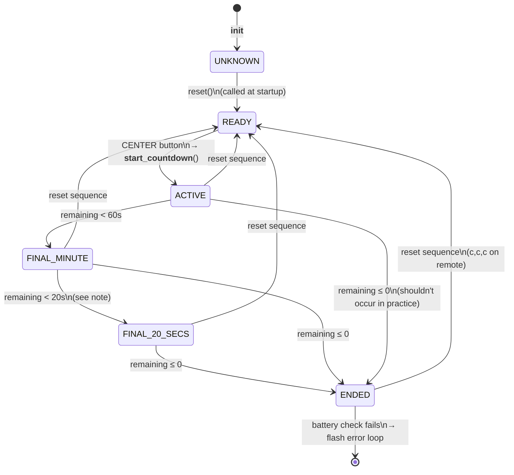
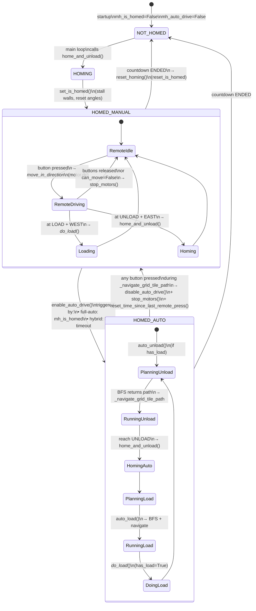
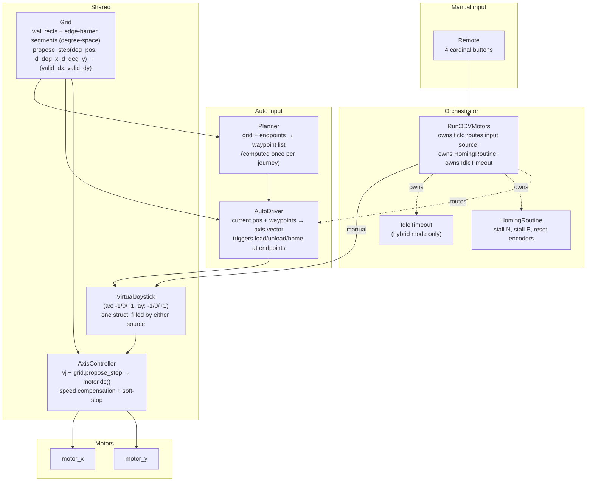
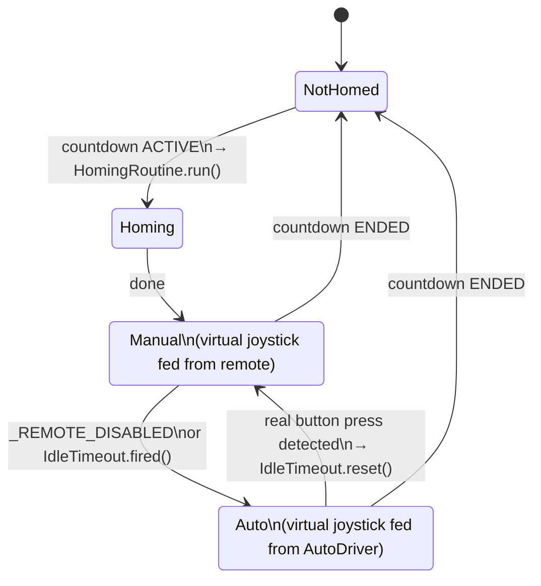

# ODV Movement System — Current State Analysis

A shared-context document for Claude and the dev, written before a redesign of
the movement system. Focused on `modules/vehicle_odv.py`. Sibling vehicles
(train, skid_steer, servo) are only touched where the shared base imposes
constraints on ODV.

The doc is in two parts. **Part A** describes the system as it stands today.
**Part B** captures the redesign direction and the target architecture.

---

# Part A — Current state

---

## 1. Stated goals (from the dev)

1. **ODV = Omni-Directional Vehicle.** Moves in 8 compass directions (cardinals + diagonals).
2. **Two control modes.** Remote-controlled by a human, or automatic.
3. **Runs on a physical grid.** Motor rotation maps directly to position on
   the grid — no localisation, no sensors beyond motor encoders.
4. **Grid is made of physical LEGO tiles.** Described to the robot by an array
   of strings, one row per line, one character per tile.

The code aligns with all four. See `ODV_GRID_DEFAULT = ["L#<#U", …]`,
`_ALL_DIRECTIONS = (N, E, S, W, NE, SE, SW, NW)`, `Remote` in
`handle_remote_press`, `auto_load` / `auto_unload`.

---

## 2. Additional goals implied by the code

These aren't in the list above but the current implementation clearly targets
them. The redesign should explicitly decide which to preserve.

| #   | Implied goal                                                                                                                                                       | Evidence                                                                                                                                                                                       |
| --- | ------------------------------------------------------------------------------------------------------------------------------------------------------------------ | ---------------------------------------------------------------------------------------------------------------------------------------------------------------------------------------------- |
| 5   | **Load/unload workflow.** The robot is a cart that picks up at `L` and drops at `U`.                                                                               | `has_load` state, `_do_load_`, `auto_load`, `auto_unload`, `home_and_unload`. Modelled on Akiyuki's [Omni-Directional Vehicles GBC](https://rebrickable.com/mocs/MOC-224417) (README line 19). |
| 6   | **Absolute position from physical homing.** On startup the robot stalls against two perpendicular walls to establish (0,0); motor encoders are trusted thereafter. | `home_and_unload` — `run_until_stalled` NORTH then EAST, then `motor.reset_angle(...)`.                                                                                                        |
| 7   | **One-way directed flow.** Tiles `<` and `>` let the grid designer force loops.                                                                                    | `WEST_ONLY_TRACK`, `EAST_ONLY_TRACK`, `ODV_GRID_EX3` = clockwise loop.                                                                                                                         |
| 8   | **Pre-drive collision safety.** The robot refuses commands that would drive it into a wall or into a one-way tile against its flow.                                | `can_move_in_direction_by_type`, `_can_traverse_coarse`.                                                                                                                                       |
| 9   | **Runs on a memory-constrained PyBricks Technic Hub.**                                                                                                             | `const()` everywhere, `mem_info()` debug calls, PLAN.md "O(N²) BFS memory crash" background, BFS rewritten with parent-pointer map.                                                            |
| 10  | **Three drive modes: manual / hybrid / full-auto.**                                                                                                                | README table + `ODV_AUTO_DRIVE_TIMEOUT_SECS`, `_REMOTE_DISABLED`, `mh_auto_drive`, `mh_is_homed` state in `MotorHelper`.                                                                       |
| 11  | **Shared runtime with 3 other vehicle types.** Compiled per-vehicle to keep only one vehicle's code on the hub.                                                    | `tools/compile_pybricks_files.py`, `# IMPORTS_START/END`, `# MODULE_START/END`, `# DRIVE_SETUP_START/END` markers.                                                                             |
| 12  | **Time-limited operation.** Countdown timer stops all vehicles after N minutes.                                                                                    | `CountdownTimer` in `lego_vehicle_timer_base.py`. Interactive-display use case.                                                                                                                |
| 13  | **Graceful hand-off between auto and manual.** Any remote press interrupts an auto run.                                                                            | `_navigate_grid_tile_path` checks `remote.buttons.pressed()` on every tile.                                                                                                                    |

---

## 3. Movement system as it stands today

### 3.1 Coordinate spaces

Three distinct spaces, all used simultaneously:

| Space           | Unit           | Where it lives | Derivation                             |
| --------------- | -------------- | -------------- | -------------------------------------- |
| **Coarse grid** | 1 tile         | `(x, y)` ints  | Grid string index                      |
| **Fine grid**   | 1/10 of a tile | `(x, y)` ints  | `motor.angle() // _GEAR_RATIO_TO_GRID` |
| **Motor angle** | degrees        | int            | Direct from `motor.angle()`            |

Constants that bind them:

- `_GEAR_RATIO_TO_GRID = 80` — motor degrees per fine unit
- `_FINE_GRID_SIZE = 10` — fine units per coarse tile (so 800° per tile)
- `_ODV_SIZE = 8` — cart footprint in fine units (≈ 0.8 tile)

Conversions:

- `_tile_to_angle(tile)` — coarse → motor angle
- `_get_fine_grid_position_()` — motor angle → fine
- `_get_grid_tile_from_fine_xy_(fine_pos, use_fuzzy)` — fine → coarse (with optional half-cart offset)
- `_navigate_to_grid_tile(tile)` — coarse → motor angle → `run_target`

### 3.2 Two parallel movement-validation paths

The rules (walls, one-way, UNLOAD-blocks-NORTH) are expressed twice:

| Path                  | Function                                                                     | Input                                                  | Used by                                           |
| --------------------- | ---------------------------------------------------------------------------- | ------------------------------------------------------ | ------------------------------------------------- |
| **Realtime / fine**   | `can_move_in_direction_by_type(dir, tl, tr, br, bl)` at `vehicle_odv.py:120` | 4 corner tile types of an `ODVBox` centred on the cart | `_can_move_in_direction_` → `handle_remote_press` |
| **Planning / coarse** | `_can_traverse_coarse(from_type, to_type, dir)` at `vehicle_odv.py:145`      | Tile pair + direction                                  | `_bfs_path_to_grid_tile`                          |

PLAN.md explicitly chose this split; both implementations currently stay in
sync, but every rule addition needs two edits.

### 3.3 Two parallel motion models

| Model                         | Call                                                 | Used by                                                |
| ----------------------------- | ---------------------------------------------------- | ------------------------------------------------------ |
| **Free-running (duty cycle)** | `motor.dc(±drive_speed)` on one or both motors       | `_move_in_direction_` → `handle_remote_press` (remote) |
| **Go-to-angle**               | `motor_x.run_target(...)`, `motor_y.run_target(...)` | `_navigate_to_grid_tile` → BFS playback (auto)         |

These share one source of truth (motor encoders) but behave very differently:

- `dc()` runs forever until stopped; position drifts freely.
- `run_target()` blocks (X blocks; Y runs concurrently and is polled — see
  `vehicle_odv.py:462`).
- Diagonals under `dc()` run both motors at full duty, so diagonal speed is
  √2× cardinal speed. Under `run_target()` the X-motor blocks and Y-motor is
  polled until convergence, so diagonals finish in different wall-clock time.

### 3.4 Collision geometry (remote path)

`_can_move_in_direction_` (line 328) builds an `ODVBox` at each remote tick:

```python
cart = ODVBox((fine_x - _ODV_SIZE // 2, fine_y + 1), _ODV_SIZE, _ODV_SIZE)
```

It advances each of the four corners by one fine unit in the requested
direction, looks up the tile type under each corner, and passes the four types
to `can_move_in_direction_by_type`.

Notes on the geometry:

- The `+1` on Y is an explicit workaround (comment line 330-331) "so the top
  edge isn't flush with fine_y" — i.e. the centering isn't symmetric.
- The check advances the whole box by 1 fine unit, so it's really a
  "can this box exist at (cart + step)?" check, not a swept check. Fast moves
  can theoretically skip it.
- `position_from_direction` adds ±1 on the diagonal regardless of whether the
  geometric step is √2 (not a bug here, because it's a unit step in each axis,
  but the mental model doesn't match physical travel distance).

### 3.5 Pathfinding (auto path)

`_bfs_path_to_grid_tile` (line 517):

- BFS over 8 directions from start tile until end tile pops.
- Uses a parent-pointer dict `{tile: (parent, dir)}` and reconstructs path backwards.
- For diagonal moves, rejects if **either** side-cell (cx or cy) is a wall, or
  if cx is a one-way tile facing against the move.
- Returns `[(tile, direction_taken_to_get_there), ...]` starting with
  `(start, -1)`.

`_navigate_grid_tile_path` (line 466):

- Walks the path tile-by-tile with `_navigate_to_grid_tile(...)`.
- When consecutive path segments share the same direction it uses
  `Stop.NONE` on the intermediate segment for a smoother straight-line run.
- Aborts mid-run if any remote button is pressed.

### 3.6 Homing

`home_and_unload` (line 298):

1. Stall Y-motor NORTH → hit top wall → `reset_angle` to unload-tile Y.
2. Move one pitch south to park on the unload tile.
3. Stall X-motor EAST → hit right wall → `reset_angle` to unload-tile X + (FINE_GRID_SIZE-1)\*GEAR_RATIO.
4. Run to centre of unload tile on X.

The homing walls are a physical fact about the build (top + right of the
UNLOAD tile). The grid string doesn't encode this geometry — it's baked into
`home_and_unload`. `UNLOAD` as a tile type separately carries the
"blocks NORTH" rule so that no other code path drives into the top wall.

### 3.7 Grid-string semantics

Each character encodes **multiple orthogonal concerns** in one byte:

| Concern                  | Characters     | Notes                                            |
| ------------------------ | -------------- | ------------------------------------------------ |
| Passability              | `X` vs others  | Wall or track                                    |
| Direction restriction    | `<`, `>`       | One-way streets                                  |
| Endpoint role            | `L`, `U`       | Where to load / where to unload                  |
| Physical homing geometry | (implicit) `U` | Homing walls are at N+E of `U` — not spelled out |

Example: a tile that's "track, one-way east, not a load/unload point" is `>`.
There's no way to express "load tile that's also one-way west" because each
position gets exactly one character.

---

## 4. Current state diagrams

### 4.1 Countdown timer states

Defined in `lego_vehicle_timer_base.py:187-192`. Driven by `CountdownTimer`
and the main loop in `main()`.



**Note — FINAL_20_SECS is unreachable as written.** In `has_time_remaining()`
(`lego_vehicle_timer_base.py:242-254`), the two guarded `if` blocks are
sequential, not `elif`. When remaining < 20s, the `< 20s` branch sets
`_FINAL_20_SECS`, then the `< 60s` branch immediately overwrites it with
`_FINAL_MINUTE`. The LED in the last 20s flashes as `_FINAL_MINUTE`
(orange 500/250), not the faster `_FINAL_20_SECS` (orange 200/100). The
diagram shows the intended transition; call out whether the redesign keeps
the bug or reorders the checks.

### 4.2 Auto ↔ manual drive transitions

Driven by `MotorHelper.mh_auto_drive` and `mh_is_homed`, and by the main
loop in `lego_vehicle_timer_base.py:492-533`. Three configs produce three
behaviours:

| Config      | `_REMOTE_DISABLED` | `ODV_AUTO_DRIVE_TIMEOUT_SECS` |
| ----------- | ------------------ | ----------------------------- |
| Full manual | False              | 0                             |
| Hybrid      | False              | > 0 (e.g. 30)                 |
| Full auto   | True               | 0                             |



**Key transitions to note for the redesign:**

1. **Auto enable is polled, not evented.** Main loop checks every tick
   whether to call `enable_auto_drive()`. Two triggers: full-auto (homed +
   remote disabled) or hybrid (idle timeout fired).
2. **Auto → manual hand-off has a debounce trick.** After
   `_navigate_grid_tile_path` returns False (button interrupt), the main loop
   calls `reset_time_since_last_remote_press()` so the hybrid timeout doesn't
   immediately re-fire and re-enable auto on the next tick.
3. ~~**Homing is re-entered on timer reset.** When the countdown goes
   `ENDED`, `reset_homing()` unsets `mh_is_homed`, so the next countdown
   start forces re-homing. Auto mode will re-enable after the next home.~~ not needed as homing is done as part of every unload
4. ~~**Remote-press detection is coarse.** `_navigate_grid_tile_path` checks
   `remote.buttons.pressed()` only between tiles — not during a single
   `_navigate_to_grid_tile` call. A button press during a straight run is
   latency-bound on arrival at the next tile.~~ this is janky for the user, feels like remote is not responding on first try.
5. **LOAD/UNLOAD actions are available in both modes.** In manual, driving
   into LOAD with WEST pressed or UNLOAD with EAST pressed triggers the
   action. In auto, the BFS plan always ends on LOAD or UNLOAD and the
   action runs unconditionally. Mode-specific wiring of the same underlying
   `_do_load_` / `home_and_unload`.

---

## 5. Things that hamper the current design

These are friction points the dev can draw on for the redesign. Each is a
symptom — the redesign gets to decide whether to fix the symptom or the root.

### 4.1 Rule duplication across coarse / fine

Every movement rule (wall, one-way, UNLOAD-NORTH) is implemented twice —
`can_move_in_direction_by_type` (corner-box form) and `_can_traverse_coarse`
(tile-pair form). The duplication was deliberate per `.claude/PLAN.md`
("Pathfinding and real-time driving can use separate movement validation
logic"), but the two forms have different shapes (4-corner vs tile-pair) and
any rule change requires edits in both. They can drift silently — tests catch
some drift but not all.

### 4.2 Two motion models with shared position state

`dc()` (remote) and `run_target()` (auto) drive the same motors and share the
same encoder state. Switching mid-action is only partially handled:

- Auto → manual: `_navigate_grid_tile_path` polls for button press and aborts.
- Manual → auto: the `last_fine_grid_position` freshness check in
  `handle_remote_press` (line 604-608) is a workaround to avoid issuing new
  `dc()` commands while a previous tick hasn't updated encoder state.

Diagonals: `dc()` diagonals run at √2× speed; `run_target()` diagonals finish
at whichever axis arrives last. Neither is "omni-directional with uniform
speed" in a physical sense.

### 4.3 Grid string overloads meaning

One character per tile forces every new concept into the character set:

- `L`, `U` are role markers and endpoints.
- `<`, `>` are direction restrictions.
- `U` additionally implies homing-wall geometry.
- An earlier design had `H` (HOME) separately (see `.claude/WORK.md`);
  that was collapsed into `U`, concentrating even more meaning on one character.

Anything future (multiple load points; a "slow zone"; a rotation-required
station; diagonal-only tiles) adds another character and more special cases.

### 4.4 Fine grid is half-reified

Fine coordinates are ints derived on demand from motor angles. They're passed
around freely but there's no `FinePosition` type — you can't tell from a
signature whether `(x, y)` is coarse or fine. `_get_grid_tile_from_fine_xy_`
takes a `use_fuzzy` bool that means "add half a cart first" — a small example
of the conversion being open-coded at each call site.

### 4.5 `ODVBox` is a thin wrapper

The class holds 4 corner tuples and supports `buffer()` (never used at the
call site of interest). `_can_move_in_direction_` uses it once, reads 4
corners, and discards it. A tuple of 4 corners, or inlined corner expressions,
would convey the same meaning. The abstraction suggests richer planned usage
that didn't materialise.

### 4.6 Magic-number geometry in homing

`home_and_unload` computes target angles with raw formulas like
`unload_tile_angle[0] + ((_FINE_GRID_SIZE-1) * _GEAR_RATIO_TO_GRID)`. The
intent ("sit flush against the right wall, then step half a tile west to
centre") isn't obvious from the arithmetic. Same pattern appears in
`_navigate_to_grid_tile` (`+ (_FINE_GRID_SIZE // 2) * _GEAR_RATIO_TO_GRID`).

### 4.7 Position is trusted forever after homing

No re-homing during operation, no slip detection. Auto mode can run for
minutes, and each `run_target` assumes encoder angle = real position. This
is an acceptable tradeoff on a clean belt drive but is a hard constraint on
any future feature that adds mechanical uncertainty (heavier cart, faster
moves, intentional bumps).

### 4.8 Compile step is load-bearing

The source of truth is `modules/vehicle_*.py`; the hub runs the compiled
`docs/pybricks/lego_vehicle_timer_*.py`. Tests import the source module.
The compile step splices four marker-delimited sections (`# IMPORTS_START`,
`# VARS_START`, `# MODULE_START`, `# DRIVE_SETUP_START`) into a template.
The split exists to save hub memory (only one vehicle's code ships), and any
movement redesign must preserve the marker boundaries or update the compile
tool.

There's also a `const = mock_const` fallback at module top-level so pytest can
import without PyBricks's `const()` behaving as a hard constant. Tests mock
`Motor`/`Remote` via `MagicMock`.

### 4.9 BFS runs fresh every auto cycle

`auto_load` and `auto_unload` each call `_bfs_path_to_grid_tile` from current
position to the endpoint. For static grids and fixed endpoints this is
repeated work. It's been rewritten to use O(N) memory (parent-pointer map),
so the cost is time, not memory; probably fine but worth deciding.

### 4.10 Direction encoding

Directions are `int` consts (0..7) with helpers like `position_from_direction`
and `dir_to_str`. A tuple `(dx, dy)` per direction would unify
"how does a step affect coarse / fine / motor target" — right now
`position_from_direction`, `_move_in_direction_` (duty-cycle axes), and
`_navigate_to_grid_tile` (target angles) each re-derive that mapping from the
direction enum.

---

# Part B — Future state

---

## 6. Redesign direction

Captured from the dev during review of Part A — direction-setting
decisions for the new movement system. Each note supersedes the current
behaviour described in the corresponding Part A section.

### N1 — 8-direction movement is not a fixed requirement

Original implied goal ("moves in 8 compass directions, cardinals +
diagonals") came from the code, not from the product. The dev would prefer
the control feel to be **more like actual driving** — not a push-a-direction
joystick abstraction over a gantry.

Implication: diagonals, and the current "press-two-buttons-for-NE" remote
scheme, are on the table. The validation/planning stack currently expends
significant complexity supporting diagonals (corner-cell checks in BFS,
√2× speed under `dc()`, 8-way enum). Dropping or reshaping this is fair game.

### N1a — Control feel: arcade-style fluid motion

Refining N1. The remote buttons are on/off only (no analog), so the model is
**classic 4-button arcade, hold-to-glide**, not tile-hopping:

- **Fluid motion while held.** Hold N → cart glides N at constant speed.
  Same for E/S/W.
- **Diagonals via two-button combos.** Hold N+E → NE. So the direction set
  is still effectively 8-way, but all expressed as combinations of the four
  cardinal buttons rather than a dedicated diagonal state.
- **Release = soft stop.** Not a hard brake — let it ramp down over a short
  window so the stop doesn't jar the mechanism. ("Hysteresis" in the sense
  of a smoothed transition, not a dead-zone.)
- **Speed compensation for diagonals.** A naïve diagonal under `motor.dc()`
  runs both axes at full duty, giving √2× cardinal speed along the diagonal.
  The redesign needs to scale per-axis duty when both are active so the
  cart's speed _over the grid_ is roughly constant regardless of direction.

Implication: the movement layer is no longer a tile-stepper. It's a
continuous-position axis controller with (a) validation that the next
physical step is legal, (b) per-axis duty shaping to honour speed caps, and
(c) a ramped stop when input is released.

### N1b — Per-axis independence: slide, don't stop

Treat the four buttons as the four microswitches inside an old arcade
joystick — each axis is its own input channel, and both axes can be active
simultaneously to give a diagonal.

Validation and motion **decompose per axis**. If the user holds N+E and the
E direction is blocked by a wall or a `>` one-way, the X motor stops but
the Y motor keeps running — the cart slides north until E clears or the
user changes input. (Current behaviour is "composite NE blocked → full
stop", which the dev wants to drop.)

Implications for the code:

- Kill the 8-way composite direction enum in the runtime path. Validation
  becomes two independent predicates, one per axis.
- The corner-box `can_move_in_direction_by_type` simplifies dramatically —
  maybe just "the leading edge in each axis doesn't overlap a blocking tile".
- Diagonal-corner-cell BFS checks are no longer needed for manual driving.
  (Auto pathfinding is a separate decision — still open.)

### N1c — Auto-drive is a virtual joystick

Manual and auto share one motion layer. Auto-drive = a virtual joystick
feeding the same per-axis controller, with a very light planner on top.

- **Planner**: BFS over the static grid, computed once per journey
  (L→U and U→L). No 8-direction search, no diagonal corner-cell checks.
- **Path shape**: list of **waypoint tiles** (turn points), not every tile
  between them. A straight run collapses to one segment.
- **Segments allow corner-cut diagonals.** A segment with `dx≠0` and `dy≠0`
  is driven by pressing both axes at once; each axis stops independently
  when it reaches its target. E.g. `(2,2)→(3,0)` with `dx=+1, dy=-2`: press
  N+E → cart moves NE at equal speed → X axis arrives at `x=3` first and
  stops → Y axis continues N alone to `y=0`. This gives natural corner-cut
  behaviour without the current `run_target` tile-hopping feel.
- **Remote takes over via the same joystick**. A real button press
  overrides the virtual one on that axis. Hand-off becomes trivial — no
  separate state machine; the controller just stops receiving virtual
  inputs on that axis.

Example (DEFAULT grid, L→U):
`[(0,0), (1,0), (1,2), (2,2), (3,0), (4,0)]`
— five segments, two of them multi-tile cardinal, one diagonal-cut.

### N1d — `<`/`>` are single-edge barriers, not whole-tile restrictions

Current code treats a `<` tile as blocking any eastbound move that enters
_or_ leaves it. The physical model is narrower:

- `<` places an invisible wall on its **west edge**. Eastbound traffic
  can't cross in from the west. Westbound traffic may cross the wall (in
  the direction of the arrow).
- `>` places an invisible wall on its **east edge**. Westbound traffic
  can't cross in from the east. Eastbound traffic may cross the wall.

Validation becomes per-edge, not per-tile:

> The boundary between west-tile `a` and east-tile `b` is walled if
> `a == '>'` or `b == '<'`. A walled edge admits crossing only in the
> arrow's direction.

Consequences:

- The N/S axis doesn't care about `<`/`>` at all — those only wall E/W edges.
- Diagonal segments that merely _straddle_ a `<` column (e.g. the NE cut
  from `(2,2)` to `(3,0)` in DEFAULT) are fine, because the E-axis only
  ever crosses the single `(2,row)→(3,row)` boundary, and from `#` tile
  (2,2) to `#` tile (3,2) that edge isn't walled.
- Existing code's "corner-cell" diagonal check in BFS disappears — edges
  are one-dimensional, they only block one axis.

### N1e — Grid representation: keep single-character strings

The grid stays as a list of strings — terse, compact, easy to eyeball and
hand-edit. No parallel grids, no structured records.

**Authoring conventions** (physical build facts, not runtime rules):

- Exactly one `L` tile and exactly one `U` tile per grid.
- `U` sits on the east edge.
- `L` sits on the west edge.
- The tile directly north of `U` must be a wall — either the grid's
  north boundary (i.e. `U` sits in row 0) or an explicit `X` above it.

Homing semantics fall out of the conventions:

- Stall Y-motor NORTH against the guaranteed wall above `U`.
- Stall X-motor EAST against the guaranteed wall to the east.
- Reset encoders, move onto the `U` tile.

Because the wall above `U` is guaranteed by convention, the current
"UNLOAD blocks NORTH" rule in `_can_traverse_coarse` is redundant with the
generic `to_type == WALL` check. Dropping it shrinks the rule set.

_(Historical note: an earlier design had separate `H` (home) and `U`
(unload) tiles; they were merged because the distinction confused users
without adding value — the same tile does both jobs.)_

### N1f — Movement model: AABB-in-tile-grid, not tile-stepping

The mental model that matches the physics best is a video-game one:
the cart is a fixed-size rectangle moving through a space bounded by
wall rectangles and edge-barrier segments. Coarse tiles are an
authoring and planning convention, not the runtime coordinate system.

Runtime is entirely in **motor degrees** — no intermediate fine-grid
layer (see also the N1f.1 note on unit collapse below):

- **Cart** = `_CART_SIZE_DEG × _CART_SIZE_DEG` AABB, tracked by its
  centre point in motor degrees (one int per axis, read directly from
  `motor.angle()`).
- **Walls** = rectangles in degree-space, derived from `X` tiles (and
  the grid boundary), scaled by `_DEG_PER_TILE`.
- **Edge barriers** = single line segments in degree-space, derived
  from `<` and `>` tiles (N1d), direction-aware.
- **Per tick**, the `AxisController` asks the `Grid` to validate a
  proposed `(d_deg_x, d_deg_y)` step (a few hundred degrees per tick
  or less). The Grid returns the largest valid step ≤ the proposed
  one, per axis; an axis that can't move returns `0`.

What falls out automatically:

- **Corner-cut safety** — no separate predicate. If the cart's AABB
  sweep during a cut overlaps an `X` rectangle, the step is rejected
  and that axis stalls. If the diagonal tile is `#`, the sweep passes
  and the cut happens. This subsumes the "is this cut geometrically
  safe?" question from #3.
- **Micro-stepping** — the controller can propose 1 fine unit at a
  time; sub-tile movement is just smaller deltas.
- **Calibration room** — the theoretical 640° cart footprint (8 fine
  units × 80°/unit) is a starting point. A small calibration remote
  program (stall east, log `motor.angle()`; stall west, log; subtract)
  gives the real safe box. Widening `_CART_SIZE_DEG` to absorb
  backlash/jitter automatically tightens the forbidden zone with no
  other code change.

Implications:

- The per-edge predicate proposed in N1d still describes the rules,
  but the runtime interface is
  `Grid.propose_step(deg_pos, d_deg_x, d_deg_y)`, not
  `Grid.can_cross_edge(tile, axis_dir)`. Edge barriers are stored as
  segments in degree-space and tested against the AABB sweep.
- The Planner still works in coarse tiles (BFS over turn-points), but
  the AutoDriver emits a virtual joystick aimed at the next
  waypoint's tile-centre _in degrees_ and lets `propose_step` handle
  all geometry.
- "Waypoint tolerance" collapses to "how close to the waypoint's
  degree-centre counts as arrived" — a small neighbourhood in degrees
  (roughly ±160° ≈ ±2 fine units of slack), not a geometry-gated
  per-waypoint decision.

### N1f.1 — Unit collapse: motor degrees as the runtime coordinate

Related decision: drop the intermediate **fine-grid** integer layer
(`_FINE_GRID_SIZE`, `_GEAR_RATIO_TO_GRID`, `_get_fine_grid_position_`)
in favour of a single coordinate space — motor degrees straight from
`motor.angle()`.

What this replaces:

- Current code has three coordinate spaces (coarse / fine / motor
  angle) with helpers to convert among them at every call site.
- The fine-grid layer added a human-readable "how many tenths of a
  tile am I into this tile" unit, mostly for debug prints.

Why it's worth losing:

- `propose_step` operates on raw `motor.angle()` values directly; no
  integer-divide-and-remultiply-to-read-back.
- Homing's `motor.reset_angle(target_deg)` and waypoint targets live
  in the same unit, so the "off-by-one fine unit" class of bug
  disappears.
- Fewer constants to keep in sync. `_DEG_PER_TILE` and
  `_CART_SIZE_DEG` are the two geometric constants; everything else
  derives from them.

Retained as a convenience:

- Coarse tile coordinates remain the **authoring / planning** unit —
  the grid string, the waypoint list, user-facing prints.
  `coarse_to_deg(tile) -> (deg_x, deg_y)` at tile centre is the only
  conversion used in anger; `deg_to_coarse(deg_pos)` exists for
  endpoint detection (have we reached LOAD/UNLOAD?).

### N3 — MicroPython/Technic Hub shapes what "modular" means

The dev's natural instinct is to split responsibilities into discrete
modules and classes. The Technic Hub runtime works against that:

- PyBricks runs a single file on the hub. The compile tool
  (`tools/compile_pybricks_files.py`) splices source modules into one
  artifact via `# IMPORTS_START/END`, `# VARS_START/END`,
  `# MODULE_START/END`, `# DRIVE_SETUP_START/END` markers.
- Every class and function carries non-trivial RAM overhead; the existing
  module has already paid the `Queue`-removal tax (PLAN.md) and the
  `list` → `tuple` hot-path conversion.
- `const()` and `const = mock_const` shim for tests — const behaviour is
  compile-time on the hub, runtime in tests.

Implication: "discrete" in this codebase means **discrete within a flat
namespace** — small cohesive classes and free functions, not a deep
directory of packages. The compile tool can be extended to splice more
source files, but at runtime they're one file with one module scope.

Practical guidance for the redesign:

- Keep each concern in its own small class when that helps clarity
  (e.g. `CountdownTimer`, `IdleTimeout`, `OdvPlanner`, `AxisController`).
- Avoid proliferation — every new class costs a bit of RAM. Three focused
  classes beat a dozen fine-grained ones.
- Tests can import individual source modules; production sees the spliced
  single file.
- Plan ahead: if a redesign adds more source files, extend the compile
  tool's splice markers rather than working around them.

### N2 — Timer logic shouldn't be ODV-shaped

`CountdownTimer` in `lego_vehicle_timer_base.py` is generic in intent but
carries ODV-specific state:

- `reset_time_since_last_remote_press` / `remote_button_press_timed_out`
  exist only for ODV's hybrid-auto-drive timeout.
- The timeout is threaded through `ODV_AUTO_DRIVE_TIMEOUT_SECS` at module
  scope, imported into the timer.

The other three vehicles (train, skid_steer, servo) **all require a remote**
and have no auto mode, so none of the idle-timeout machinery applies to
them. The timer class is doing double duty.

Implication: split the timer. Keep a generic countdown (used by all four
vehicles) and lift the idle-timeout into an ODV-specific concern — either
inside `vehicle_odv.py` or into a small separate helper the base loop calls
only when the driver supports it.

---

## 7. Proposed future-state architecture

Pulling N1a–e, N2, and N3 into one concrete shape. All classes sit in the
flat module namespace per N3; none of this requires new nested packages.

### 7.1 Component overview



### 7.2 What each class owns

| Class                                     | Owns                                                                                                                                                                                                                                                                                                                                                                                                 | Does not own                                               |
| ----------------------------------------- | ---------------------------------------------------------------------------------------------------------------------------------------------------------------------------------------------------------------------------------------------------------------------------------------------------------------------------------------------------------------------------------------------------- | ---------------------------------------------------------- |
| **`CountdownTimer`** _(shared, stripped)_ | Session length: `READY / ACTIVE / FINAL_MINUTE / FINAL_20_SECS / ENDED`, hub LED state for the session.                                                                                                                                                                                                                                                                                              | No idle-timeout logic, no ODV knowledge.                   |
| **`IdleTimeout`** _(ODV-only helper)_     | "How long since the last real remote press?" `reset()`, `fired() -> bool`.                                                                                                                                                                                                                                                                                                                           | The auto/manual decision itself — it's just a bool source. |
| **`Grid`**                                | The `list[str]` grid; resolved `load_tile` and `unload_tile`; wall rectangles and edge-barrier segments in degree-space derived from `X`/`<`/`>` tiles and the grid boundary; `propose_step(deg_pos, d_deg_x, d_deg_y) -> (valid_dx, valid_dy)` which AABB-tests the cart sweep and returns the largest per-axis step that stays legal; `coarse_to_deg` / `deg_to_coarse` helpers; tile-type lookup. | Cart position, motion, planning.                           |
| **`Planner`**                             | Once-per-journey 4-direction BFS over the grid; produces a **waypoint list** (turn-points only). Two paths cached: L→U and U→L.                                                                                                                                                                                                                                                                      | Driving the cart.                                          |
| **`VirtualJoystick`**                     | A tiny value type: `(ax, ay)` each in `{-1, 0, +1}`. Nothing else.                                                                                                                                                                                                                                                                                                                                   | Anything.                                                  |
| **`AxisController`**                      | `motor_x` + `motor_y`. Consumes a `VirtualJoystick` every tick, asks `Grid.propose_step` to clip the requested movement against the walkable polygon, produces `motor.dc()` commands with (a) per-axis speed compensation so diagonal cart speed ≈ cardinal cart speed, (b) a short ramped stop when an axis goes active→idle. Reports current `(deg_x, deg_y)` position read from `motor.angle()`.  | Planning, mode logic, the geometry itself (owned by Grid). |
| **`AutoDriver`**                          | Walks a waypoint list. Each tick: compares current tile to next waypoint, emits `VirtualJoystick` with the sign of each axis delta. Advances waypoint when within tolerance. Triggers `do_load`, `do_unload`, `HomingRoutine` at journey end. Detects "real remote pressed" and yields.                                                                                                              | The movement itself, the grid rules.                       |
| **`HomingRoutine`**                       | Stall Y-motor north, stall X-motor east, reset encoders, park on `unload_tile`. Run once on startup and on countdown reset.                                                                                                                                                                                                                                                                          | Any movement outside its own sequence.                     |
| **`RunODVMotors`** _(orchestrator)_       | Main tick. Reads the remote. Decides each tick: use real input (manual), virtual input from `AutoDriver` (auto), or no input (idle). Routes the chosen `VirtualJoystick` into `AxisController`. Owns the mode transitions in N1c below.                                                                                                                                                              | None of the sub-mechanics.                                 |

### 7.3 Data flow — manual tick

```
Remote.buttons.pressed()
  → cardinal button map → VirtualJoystick(ax, ay)
  → AxisController.tick(vj):
      proposed_dx = vj.ax × step_deg × compensation(vj)     # in motor degrees
      proposed_dy = vj.ay × step_deg × compensation(vj)
      (valid_dx, valid_dy) = grid.propose_step(deg_pos, proposed_dx, proposed_dy)
      for each axis independently:
        if |valid| > 0:
          motor.dc(duty_for(valid))
        else:
          motor soft-stop ramp      # axis blocked or vj zero
  → IdleTimeout.reset()
```

Corner-cut behaviour, wall-slide, and edge-barrier rejection all fall
out of `propose_step`: the AABB sweep of the cart against the walls
and barriers is the single source of movement truth.

### 7.4 Data flow — auto tick

```
AutoDriver.tick(deg_pos):
  target_deg = grid.coarse_to_deg(waypoints[i+1])     # tile centre in degrees
  if within_neighbourhood(deg_pos, target_deg):
    advance i
    if i == len(waypoints) - 1:
      run endpoint action (load / unload / home)
      flip journey direction
  vj.ax = sign(target_deg.x - deg_pos.x)
  vj.ay = sign(target_deg.y - deg_pos.y)
  if real_remote_pressed(): yield control, no vj output this tick
  → AxisController.tick(vj) [same as manual from here]
```

`within_neighbourhood` is a small radius in degrees around the
waypoint centre (starting value ≈ ±160°, i.e. roughly ±2 fine units
of slack). Tuneable, but the AABB geometry inside `propose_step`
handles the hard safety question, so this threshold only shapes when
to switch aim, not whether the cart is allowed to move.

### 7.5 Mode transitions



`MotorHelper` base class loses: `reset_homing`, `auto_load`, `auto_unload`,
`handle_flip` (tracked-racer specific, keep for skid steer), and the
`mh_auto_drive` / `mh_is_homed` flags. The base's concern shrinks to
"does this vehicle have a tick I should run?" and "did the session end?"

### 7.6 What's removed from today's code

- The `ODVBox` class.
- The direction enum entirely (`_ALL_DIRECTIONS`, `N`/`E`/`S`/`W` +
  diagonals, `position_from_direction`, `dir_to_str`). Runtime uses
  `VirtualJoystick(ax, ay)`; Planner's 4-dir BFS iterates over four
  literal `(dx, dy)` tuples.
- Both runtime validation functions (`can_move_in_direction_by_type`
  and `_can_traverse_coarse`). Replaced by a single
  `Grid.propose_step(fine_pos, dx, dy)` doing an AABB sweep against
  wall rectangles and edge-barrier segments (N1f).
- `_can_traverse_coarse`'s UNLOAD-blocks-NORTH rule (redundant given the
  east-edge/north-wall convention — N1e).
- Diagonal corner-cell check inside BFS — subsumed by the AABB test
  at runtime; Planner only needs 4-direction BFS.
- The geometry-gated "can_cut_corner" predicate raised in open
  question #3 — subsumed by `propose_step`.
- `run_target` / `run_until_stalled` in the drive path — homing still
  uses `run_until_stalled` during its blocking sequence, but day-to-day
  movement is all `motor.dc` governed by `AxisController`.
- The `ODV_AUTO_DRIVE_TIMEOUT_SECS` const at the base-module scope —
  moves next to its owner (`IdleTimeout`) inside the ODV module.
- The `last_fine_grid_position` freshness check in `handle_remote_press`
  — no longer needed once motion is continuous per axis.

### 7.7 What stays

- `list[str]` grid representation (N1e).
- `<` / `>` semantics — but reinterpreted as single-edge barriers (N1d).
- Three drive modes (`MANUAL` / `HYBRID` / `AUTO`) — now an explicit
  ODV-local int-const enum with a single `DRIVE_MODE` config line,
  replacing the old two-boolean encoding (see open question #6).
- The compile tool and its splice markers. If we add new source files
  (e.g. `modules/odv_grid.py`, `modules/odv_planner.py`) we extend the
  tool's marker set; everything still flattens to one on-hub file. the splice markes can be brittle, open to sugesstons on a better approach
- Tests in `tests/test_vehicle_odv.py` — parametrised shape stays, but
  the subjects move (`Grid.can_cross_edge` instead of
  `can_move_in_direction_by_type`; `Planner.plan` instead of
  `_bfs_path_to_grid_tile`).
- Homing via `run_until_stalled` against physical walls.

---

## 8. Open questions

Detail-level decisions to make during implementation, parked here so
they're not forgotten.

1. ~~**Soft-stop shape**~~ **Decided: fixed-ms duty ramp.** In
   `AxisController`, decay `motor.dc()` from current duty to 0 over a
   fixed window (~200ms starting point) when an axis goes active→idle.
   State cost: one `prev_duty` int per axis. Chosen over `Stop.COAST`
   (inconsistent feel across cart loads) and `Stop.BRAKE` (jerky).
   Ramp length is a tuning knob, not a design decision.
2. ~~**Speed compensation curve**~~ **Decided: flat 71% each when both
   axes active.** `duty = base × (0.71 if both_axes else 1.0)` inside
   `AxisController`. No analog joystick exists, so vector-normalisation
   would be the same branch with more code. Applies equally to manual
   and auto-driver diagonals since both flow through `AxisController`.
   If 0.71 feels wrong on the rig, tune the single constant.
3. ~~**Waypoint tolerance**~~ **Largely decided via N1f.** Safety is
   owned by `Grid.propose_step` (AABB sweep), so the only remaining
   knob is "when does `AutoDriver` switch aim to the next waypoint?"
   Starting value: a small fine-unit neighbourhood around the
   waypoint centre (e.g. ±2 fine units on the active axis). Tune on
   the rig. Small enough that auto-mode corner-cuts feel crisp;
   large enough that it doesn't oscillate.
4. ~~**Fine grid: keep integer fine-units or go direct to motor
   angles?**~~ **Decided: go direct to motor degrees (N1f.1).** The
   fine-grid layer is dropped. Runtime coordinate = `motor.angle()`
   directly; coarse tiles remain the authoring/planning unit with
   `coarse_to_deg` / `deg_to_coarse` helpers for the two places we
   need to convert (waypoint aim, endpoint detection). Geometric
   constants collapse to `_DEG_PER_TILE` and `_CART_SIZE_DEG`.
5. ~~**Direction encoding**~~ **Decided: kill the enum entirely.** It
   was a byproduct of the old tile-stepping movement. Runtime uses
   `VirtualJoystick(ax, ay)`; Planner's 4-dir BFS iterates over four
   literal `(dx, dy)` tuples. Removes `_ALL_DIRECTIONS`, the
   individual `N`/`E`/`S`/`W`/diagonals consts, `position_from_direction`,
   and `dir_to_str`.
6. ~~**Drive-mode representation**~~ **Decided: module-level int consts
   in `vehicle_odv.py`.** `MANUAL = const(0)`, `HYBRID = const(1)`,
   `AUTO = const(2)`, plus a single `DRIVE_MODE = HYBRID` config line.
   `RunODVMotors.__init__` reads `DRIVE_MODE` and only instantiates
   `IdleTimeout` when mode is `HYBRID`. The old two-boolean form
   (`_REMOTE_DISABLED`, `ODV_AUTO_DRIVE_TIMEOUT_SECS > 0`) is removed;
   the idle-timeout seconds becomes a config next to `DRIVE_MODE`,
   only consulted in `HYBRID`. Enum is ODV-local — the base loop and
   the other three vehicles don't need to know about it.
7. ~~**Compile-tool splice markers**~~ **Decided: keep markers, add
   guards.** Extend `tools/compile_pybricks_files.py` to fail loudly
   when any expected `START/END` pair is missing, mismatched, nested,
   or out of order in a source module. Bad files stop the build
   instead of silently producing a broken hub artifact.
   **Additional requirement**: the compiled output files
   (`docs/pybricks/lego_vehicle_timer_*.py`) must also pass the test
   suite and pass linting. That rules out classes of splice bugs that
   only manifest post-concat (duplicated symbols, broken references
   across sections, unused-import residue). Practical shape: the test
   run imports and exercises each compiled module; linting is part
   of the compile step's output, not a separate pass.

---

## 9. Files touched by the movement system

Anything the redesign has to consider:

- `modules/vehicle_odv.py` — the whole system under review.
- `modules/lego_vehicle_timer_base.py` — `MotorHelper` base class defines the
  lifecycle hooks (`home_and_unload`, `auto_load`, `auto_unload`,
  `handle_remote_press`, `stop_motors`) and the main loop in `main()` calls
  them in a fixed order. Any new hook must land here.
- `tools/compile_pybricks_files.py` — splices the four marker sections; rename
  or move either section and the compile breaks.
- `tests/test_vehicle_odv.py` — parametrized tests for both validation
  functions, BFS on the test grid, BFS on all three production grids. Any
  change to movement rules or BFS output will update expected paths here.
- `docs/pybricks/lego_vehicle_timer_odv.py` — compiled output, regenerated
  by the tool; not edited by hand.
- `.claude/PLAN.md` — completed plan that shaped current code (BFS rewrite,
  DEBUG flag, rule-based validation).
- `.claude/WORK.md` — completed work (HOME+END tile collapse into UNLOAD).
