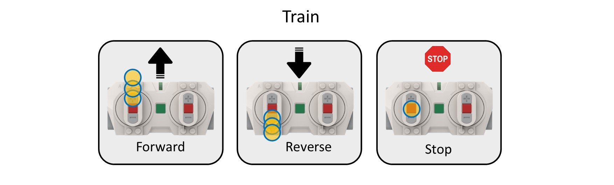
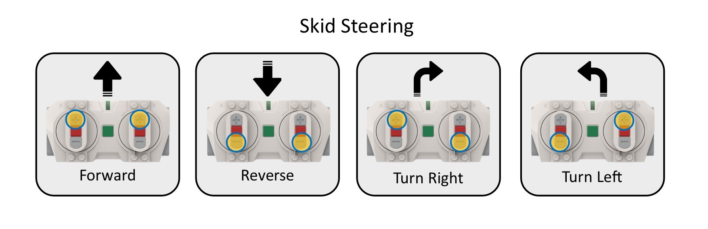
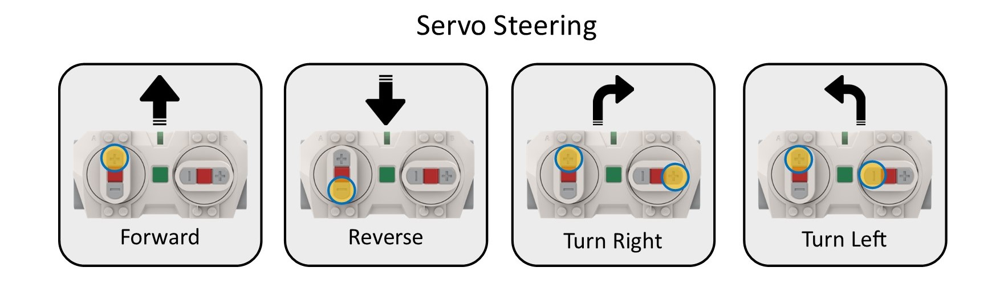

# README

## Train and Tracked Racer Program

A program to enable a time limited running of a lego vehicle.

## Requires

- Lego City Hub or Lego Technic Hub using this PyBricks firmware
- Train
  - One or two motors
- Skid Steer
  - Two motors, one for each side
- Servo Steer
  - One motor for drive
  - One motor for steering 
- Lego Remote

## How do I get set up?

- Use [PyBricks](https://code.pybricks.com/) to configure your hub
- load [lego-vehicle-timer](lego-vehicle-timer.py) into PyBricks
- configure the settings as per below Configuration
- flash to hub using PyBricks

## Using the Remote

### Train

Either button sets control forward and reverse

### Skid Steer

Left buttons left motor, Right buttons right motor

### Servo Steer

Left buttons for drive, Right buttons for steering

## Releases

### Version 1.0.0 (current)

Initial release

## Configuration

### countdown time settings

COUNTDOWN_LIMIT_MINUTES = const(3)  # run for (x) minutes, min 1 minute, max up to you. the default of 3 minutes is play
tested :).
c = center button, + = + button, - = - button
COUNTDOWN_RESET_CODE = 'c,c,c' # left center button, center button, right center button

### Vehicle type

train - Expects a train motor on Port A, and an optional train motor on Port B
skid_steer - Expects a DC motor on Port and Port B
servo_steer - Expects a DC motor on Port A and a servo type motor on Port B

VEHICLE_TYPE = 'skid_steer' # must be one of 'skid_steer', 'servo_steer' or 'train'

### Train mode settings

TRAIN_MOTOR_SPEED_STEP = const(10)  # the amount each button press changes the train speed
TRAIN_MOTOR_MIN_SPEED = const(30)  # lowest speed the train will go set between 0 and 100
TRAIN_MOTOR_MAX_SPEED = const(80)  # set between 0 and 100
TRAIN_REVERSE_MOTOR = False # set to True if remote + button cause motor to run backwards

### skid steer dual motor settings

SKID_STEER_SPEED = const(80)  # set between 0 and 100
SKID_STEER_SWAP_MOTOR_SIDES = False # set to True if Left/Right remote buttons are backwards
SKID_STEER_REVERSE_LEFT_MOTOR = False # set to True if remote + button cause motor to run backwards
SKID_STEER_REVERSE_RIGHT_MOTOR = False # set to True if remote + button cause motor to run backwards

### servo steer settings

SERVO_STEER_SPEED = const(80)  # set between 50 and 100
SERVO_STEER_TURN_ANGLE = const(45) # angle to turn wheels
SERVO_STEER_REVERSE_DRIVE_MOTOR = False # set to True if remote + button cause motor to run backwards
SERVO_STEER_REVERSE_TURN_MOTOR = False # set to True if remote + button cause motor to turn wrong way

## Copyright

Etendut

## Licence

MIT