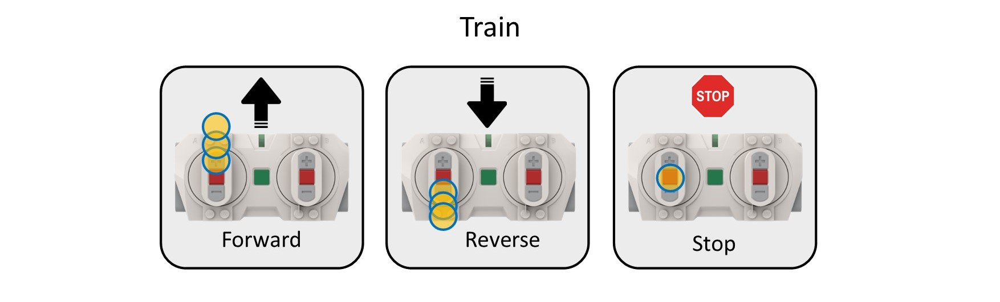
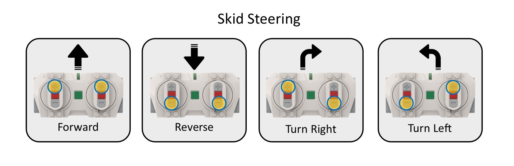
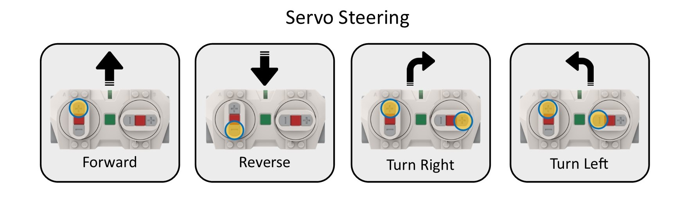

# Train, Servo Steer, and Skid Steer timed vehicle Program

A python program to enable a time limited running of a Train, Servo Steer, or Skid Steer Lego vehicle.

## Requires

- Lego City Hub or Lego Technic Hub using PyBricks firmware
- Train
  - 1 or 2 motors
- Skid Steer
  - 2 motors, one for each side
- Servo Steer
  - 1 motor for drive
  - 1 motor with rotation sensor for steering
- Lego Remote

## How do I get set up?

- Use [PyBricks](https://code.pybricks.com/) to configure your hub
- load [lego_vehicle_timer](lego_vehicle_timer.py) into PyBricks
- configure the settings as per below [Configuration](#configuration)
- flash to hub using PyBricks

## Using the Remote

### Train

Either button sets control forward and reverse

### Skid Steer

Left buttons left motor, Right buttons right motor

### Servo Steer

Left buttons for drive, Right buttons for steering

## Light Codes

### Hub Light Codes

Once the program starts certain errors will be flashed on the hub

|                                                                                                                                                                    | Sequence                   | Meaning             |
| ------------------------------------------------------------------------------------------------------------------------------------------------------------------ | -------------------------- | ------------------- |
|  or                                                             | BLUE On or flashing        | Program not running |
|  | 3 WHITE flashes then pause | Looking for remote  |
|                                                                                                           | GREEN flashing             | Ready for start     |
|                                                                                                                      | GREEN On                   | Timer Running       |
|                                                                                                        | ORANGE slow flashing       | Last 60 secs        |
|                                                                                                         | ORANGE fast flashing       | Last 20 secs        |
|                                                                                                           | ORANGE On                  | Time complete       |

### Error Codes

Once the program starts certain errors will be flashed on the hub

|                                                                                                                                                                                                                      | Sequence                  | Meaning                 |
| -------------------------------------------------------------------------------------------------------------------------------------------------------------------------------------------------------------------- | ------------------------- | ----------------------- |
|                                                                                                                                                                 | Constant RED Flash on/off | Other Error             |
|                                                                                                            | 2 RED flashes then pause  | Missing Motor on Port A |
|                                                       | 3 RED flashes then pause  | Missing Motor on Port B |
|  | 4 RED flashes then pause  | Missing Remote          |

## Configuration

All configuration should be done in [lego_vehicle_timer](lego_vehicle_timer.py) before installing
with [PyBricks](https://code.pybricks.com/)

### Vehicle type

VEHICLE_TYPE = 'skid_steer' # must be one of 'skid_steer', 'servo_steer' or 'train'

train - Expects a train motor on Port A, and an optional train motor on Port B 
skid_steer - Expects a DC motor on Port and Port B 
servo_steer - Expects a DC motor on Port A and a motor with a rotation sensor on Port B 

### Countdown time settings

COUNTDOWN_LIMIT_MINUTES = const(3) # run for (x) minutes, min 1 minute, max up to you. the default of 3 minutes is play
tested :). 
c = center button, + = + button, - = - button 
COUNTDOWN_RESET_CODE = 'c,c,c' # left center button, center button, right center button 

### Train mode settings

TRAIN_MOTOR_SPEED_STEP = const(10) # the amount each button press changes the train speed 
TRAIN_MOTOR_MIN_SPEED = const(30) # lowest speed the train will go set between 0 and 100 
TRAIN_MOTOR_MAX_SPEED = const(80) # set between 0 and 100 
TRAIN_REVERSE_MOTOR = False # set to True if remote + button cause motor to run backwards 

### skid steer dual motor settings

SKID_STEER_SPEED = const(80) # set between 0 and 100 
SKID_STEER_SWAP_MOTOR_SIDES = False # set to True if Left/Right remote buttons are backwards 
SKID_STEER_REVERSE_LEFT_MOTOR = False # set to True if remote + button cause motor to run backwards 
SKID_STEER_REVERSE_RIGHT_MOTOR = False # set to True if remote + button cause motor to run backwards 

### servo steer settings

SERVO_STEER_SPEED = const(80) # set between 50 and 100 
SERVO_STEER_TURN_ANGLE = const(45) # angle to turn wheels 
SERVO_STEER_REVERSE_DRIVE_MOTOR = False # set to True if remote + button cause motor to run backwards 
SERVO_STEER_REVERSE_TURN_MOTOR = False # set to True if remote + button cause motor to turn wrong way 

## Releases

### Version 1.3.1 (current)

Add error and hub flash codes

### Version 1.1.0

Initial release

## Licence

Copyright © 2023, [Etendut](https://github.com/etendut).
Released under the [MIT License](LICENSE).
