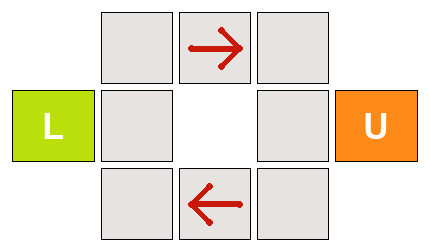

# Train, Servo Steer, Skid Steer, and ODV timed vehicle program

A python program to enable a time limited running of a Train, Servo Steer, Skid Steer, or ODV Lego vehicle.

**[Quick Start Guides](https://etendut.github.io/lego-vehicle-timer/)**

## Requires

- Lego City Hub or Lego Technic Hub using PyBricks firmware
- Train
  - 1 or 2 motors
- Skid Steer
  - 2 motors, one for each side
- Servo Steer
  - 1 motor for drive
  - 1 motor with rotation sensor for steering
- ODV:
  - This mode is specific to
    the [Omni-Directional Vehicles GBC, by Akiyuki](https://rebrickable.com/mocs/MOC-224417/Planet%20GBC/omni-directional-vehicles-gbc-by-akiyuki/#details)
  - a built ODV vehicle with 2 motors
  - a grid course to run on
- Lego Remote (not required for ODV full auto mode)

## How do I get set up?

- Use [PyBricks](https://code.pybricks.com/) to configure your hub
- select the program based on the vehicle type
  - [lego_vehicle_timer_train](docs/pybricks/lego_vehicle_timer_train.py)
  - [lego_vehicle_timer_skid_steer](docs/pybricks/lego_vehicle_timer_skid_steer.py)
  - [lego_vehicle_timer_servo](docs/pybricks/lego_vehicle_timer_servo.py)
  - [lego_vehicle_timer_odv](docs/pybricks/lego_vehicle_timer_odv.py)
- configure the settings as per below [Configuration](#configuration)
- load the program onto your hub using PyBricks

## Using the Remote

### Train

[User Quick Start](https://etendut.github.io/lego-vehicle-timer/guides/train_quick_start_user.html) | [Instructor Quick Start](https://etendut.github.io/lego-vehicle-timer/guides/train_quick_start_instructor.html)

### Skid Steer

[User Quick Start](https://etendut.github.io/lego-vehicle-timer/guides/skid_steer_quick_start_user.html) | [Instructor Quick Start](https://etendut.github.io/lego-vehicle-timer/guides/skid_steer_quick_start_instructor.html)

### Servo Steer

[User Quick Start](https://etendut.github.io/lego-vehicle-timer/guides/servo_steer_quick_start_user.html) | [Instructor Quick Start](https://etendut.github.io/lego-vehicle-timer/guides/servo_steer_quick_start_instructor.html)

### ODV

[User Quick Start](https://etendut.github.io/lego-vehicle-timer/guides/odv_quick_start_user.html) | [Instructor Quick Start](https://etendut.github.io/lego-vehicle-timer/guides/odv_quick_start_instructor.html)

## Configuration

Each vehicle has its own configuration

### Common

MILLIVOLT*CRITICAL_LEVEL = const(1.2 * 6 \_ 1000) # low voltage protection in millivolts e.g. 7.2V = 7200mV

#### Countdown time settings

COUNTDOWN_LIMIT_MINUTES = const(3) # run for (x) minutes, min 1 minute, max up to you. the default of 3 minutes is play
tested :). 
c = center button, + = + button, - = - button 
COUNTDOWN_RESET_CODE = 'c,c,c' # left center button, center button, right center button 

\_REMOTE_DISABLED = False # headless / debug flag for train, skid_steer, servo (ODV derives this from DRIVE_MODE)

### Train

Configuration should be done in [lego_vehicle_timer_train](docs/pybricks/lego_vehicle_timer_train.py) before installing
with [PyBricks](https://code.pybricks.com/)

Expects a train motor on Port A, and an optional train motor or light on Port B 

TRAIN_MOTOR_SPEED_STEP = const(10) # the amount each button press changes the train speed 
TRAIN_MOTOR_MIN_SPEED = const(30) # the lowest speed the train will go, set between 30 and 100 
TRAIN_MOTOR_MAX_SPEED = const(80) # set between 80 and 100 
TRAIN_REVERSE_MOTOR_1 = False # set to True if remote + button cause motor to run backwards 
TRAIN_REVERSE_MOTOR_2 = True # only used if a second train motor is on Port B 

### Skid Steer

Configuration should be done in [lego_vehicle_timer_skid_steer](docs/pybricks/lego_vehicle_timer_skid_steer.py) before installing
with [PyBricks](https://code.pybricks.com/)

Expects a DC motor on Port A and Port B 

SKID_STEER_SPEED = const(80) # set between 0 and 100 
SKID_STEER_SWAP_MOTOR_SIDES = False # set to True if Left/Right remote buttons are backwards 
SKID_STEER_REVERSE_LEFT_MOTOR = False # set to True if remote + button cause motor to run backwards 
SKID_STEER_REVERSE_RIGHT_MOTOR = False # set to True if remote + button cause motor to run backwards 

### Servo Steer

Configuration should be done in [lego_vehicle_timer_servo](docs/pybricks/lego_vehicle_timer_servo.py) before installing
with [PyBricks](https://code.pybricks.com/)

Expects a DC motor on Port A and a motor with a rotation sensor on Port B 

SERVO_STEER_SPEED = const(80) # set between 50 and 100 
SERVO_STEER_TURN_ANGLE = const(45) # angle to turn wheels 
SERVO_STEER_REVERSE_DRIVE_MOTOR = False # set to True if remote + button cause motor to run backwards 
SERVO_STEER_REVERSE_TURN_MOTOR = False # set to True if remote + button cause motor to turn wrong way 

### ODV

Configuration should be done in [lego_vehicle_timer_odv](docs/pybricks/lego_vehicle_timer_odv.py) before installing
with [PyBricks](https://code.pybricks.com/)

Expects a Servo motor on Port A and a Servo motor on Port C 

ODV_SPEED = const(45) # base duty %, set between 40 and 70 
IDLE_TIMEOUT_SECS = const(20) # HYBRID-mode idle period before auto-drive engages 

#### ODV Drive Modes

`DRIVE_MODE` is an ODV-local enum with three values: `MANUAL`, `HYBRID`, `AUTO`. It is the single knob — the ODV module derives `_REMOTE_DISABLED` automatically from it (`AUTO` runs headless; `MANUAL`/`HYBRID` require the remote).

| Mode        | `DRIVE_MODE` | Description                                                                                                                                                                       |
| ----------- | ------------ | --------------------------------------------------------------------------------------------------------------------------------------------------------------------------------- |
| Full manual | `MANUAL`     | Remote controls the vehicle only; no automatic movement                                                                                                                           |
| Hybrid      | `HYBRID`     | Remote controls the vehicle; after `IDLE_TIMEOUT_SECS` with no input the vehicle starts automatic load/unload cycles. Any button press yields control back and restarts the timer |
| Full auto   | `AUTO`       | No remote required; vehicle runs automatic load/unload cycles as soon as homing is complete                                                                                       |

ODV_GRID = [] grid tiles specified in a list

X = obstacle, L = Load, U = Unload/End (homing wall NORTH and EAST), # = grid tile, < = one-way left, > = one-way right

**Default** 
ODV_GRID = `["L#<#U", "X#<#X", "X###X"]` 

**Example 1** 
ODV_GRID = `["###X#XX", "LX###XU", "###X###"]` 
  

**Example 2** 
ODV_GRID = `["X###X", "L###U", "X###X"]` 
  

**Example 3 (one-way clockwise loop)** 
ODV_GRID = `["X#>#X", "L###U", "X#<#X"]` 
L→U travels top (eastward through `>`), U→L travels bottom (westward through `<`) 
  

## Releases

### Version 3.0.0 (current)

- Full re-write of ODV movement system:
  - Arcade-style hold-to-glide control: each cardinal button drives a
    virtual joystick; diagonals are two-button combos at ~71% per-axis
    speed; release ramps to stop over ~200ms
  - AABB-in-tile-grid collision in motor-degree space — one
    `Grid.propose_step` primitive validates every tick, manual and auto
  - 4-direction BFS planner producing turn-point waypoints; `AutoDriver`
    emits a virtual joystick so manual and auto share the same motion path
  - Explicit `DRIVE_MODE` enum (`MANUAL` / `HYBRID` / `AUTO`) replaces the
    two-boolean encoding
  - Idle-timeout logic split out of `CountdownTimer` into a local
    `IdleTimeout` (only active in `HYBRID`)
  - Compile tool validates splice markers and lints compiled files with
    ruff

### Version 2.3.0

- ODV autodrive fixes

### Version 2.2.0

- ODV full auto, hybrid, and manual drive modes working correctly
- Fix hybrid mode timer reset when user interrupts auto navigation
- Battery drain improvements: remote LED off during READY and ENDED states, flash calls throttled, battery voltage check reduced to once per 5 seconds
- MicroPython memory optimisations: replace list literals in hot paths with `or` chains and module-level tuple

### Version 2.1.0

- ODV autodrive fixes
- reduce memory footprint

### Version 2.0.0

- Add ODV Robot to vehicles
- Split vehicle python files to reduce memory footprint

### Version 1.4.0

- Allow trains to have lights plugged into port B

### Version 1.3.1

- Add error and hub flash codes

### Version 1.1.0

- Initial release

## Customising the code

- Clone this repo
- Update code in the [modules](/modules) folder as needed
- run [compile_pybricks_files](/tools/compile_pybricks_files.py) to create the lego*vehicle_timer*\* files for use
  in [PyBricks](https://code.pybricks.com/)

## Licence

Copyright © 2023, [Etendut](https://github.com/etendut).
Released under the [MIT License](LICENSE).
